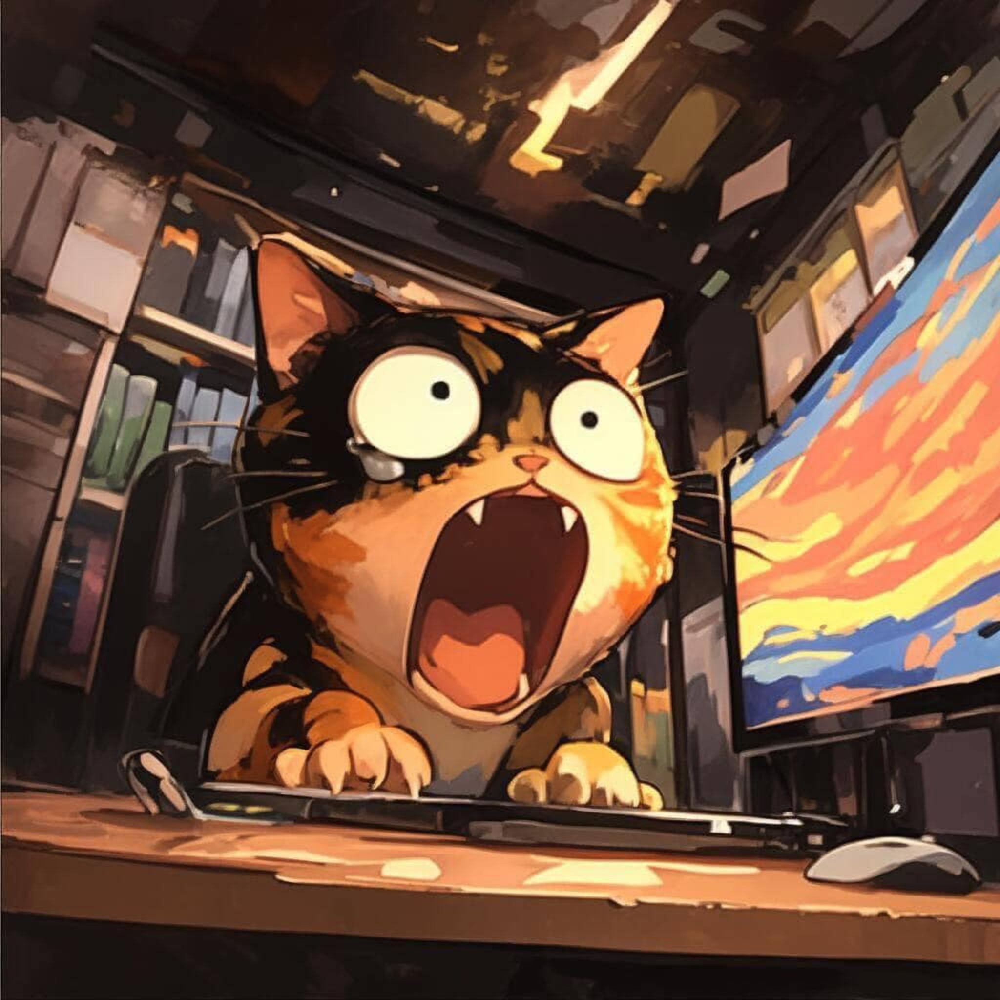

  

## Contacts:

    
    
    

 

## Tech Stack:

    
    
     
     
    
    
    
    
     
     
    
    
       
    
    
     
     
     
    
     
     
    

 

## My Stats:

    <a href="https://next.ossinsight.io/widgets/official/compose-user-dashboard-stats?user_id=84785332" target="_blank" style="display: block" align="center">
      <picture>
        <source media="(prefers-color-scheme: dark)" srcset="https://next.ossinsight.io/widgets/official/compose-user-dashboard-stats/thumbnail.png?user_id=84785332&image_size=auto&color_scheme=dark" width="771" height="auto">
        
      </picture>
    </a>    

# Hi there, I'm Brian Le! 👋

### Welcome to my GitHub profile

I'm a passionate **software developer** with a keen interest in building impactful solutions through code. My journey in technology has been fueled by curiosity and a drive to create meaningful digital experiences.

---

## 🎨 About Me

- 📊 **Role**: Software Developer
- 📝 **Experience**: Web Development, Mobile Apps, and Software Engineering
- 🌐 **Focus Areas**: Frontend & Backend Development, Clean Code, Scalable Solutions
- 🎮 **Interests**: Exploring Game Development, Open Source Contribution

---

## ⚙️ Technologies I Work With

### Programming Languages

### Frameworks & Libraries

### Tools & Platforms

---

## ✨ What I'm Currently Working On

- Developing **full-stack web applications** with modern frameworks.
- Exploring the potential of **game development** as a creative outlet.
- Contributing to **open source projects** to support the tech community.

---

## 🌍 Let's Connect

    
    
    
    

---

### ✨ Fun Fact
> "Code is like humor. When you have to explain it, it’s bad."

Thanks for visiting my profile! Feel free to explore my repositories and connect with me to collaborate on exciting projects!
