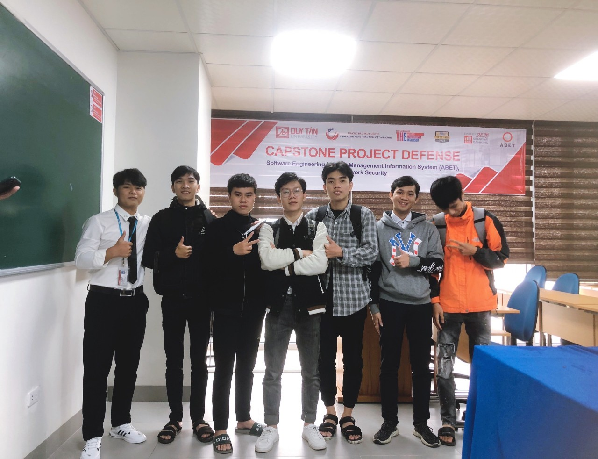

<h1 align="center">Hi there, I'm <b>Viet Anh Le</b></h1>    

- Currently, I'm student at Duy Tan University.
- Majoring in Software Engineering.
- Fullstack web developer.

 

## Contacts: 

    
    
    

  

    

 

## Tech Stack:

    
    
    
    
    
     
     
    
    
    
    
     
     
         
       
    
    
     
     
     
    

 

## My Stats:

    
     
     
    

